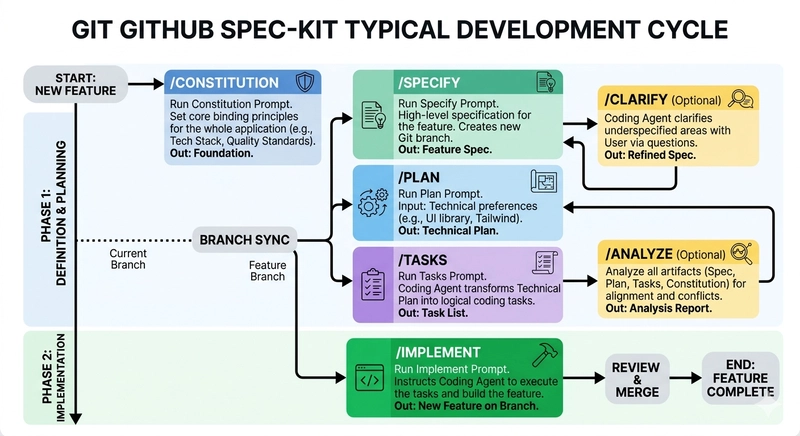

# Haven POC reference project 
This is a reference project to challenge and demonstrate the concept of Haven. [Haven](https://haven.commonground.nl/over-haven) is a standard for platform-independent cloud hosting and is part of the [Common Ground Initiative](https://commonground.nl/).
Demonstrates set of simple microservices developed with Java Spring Boot to test the Haven POC implementation and to demonstrate its capabilities.(FluxCD + Helm + Spring Boot + Keycloak + LGTM + service-to-service auth).
[Central idea is to show how to use GitOps](./docus/GitOps.md) (FluxCD) to manage the deployment of a microservices application on Kubernetes, with a focus on configuration management, service-to-service authentication, and observability.
## Spec-Driven Development (SDD) approach with GitHub Spec-kit
This project follows a Spec-Driven Development approach, where we start by defining the specifications and architecture of the application before writing any code. This ensures that we have a clear understanding of the requirements and design decisions upfront, leading to better code quality and maintainability.
Spec-driven development (SDD) turns specifications from passive documentation into excutable that constrain what AI Agents generate. 
SDD catches architectural violations and API contract drifts that unit tests structurally cannot. SDD is a powerful tool for ensuring that the implementation adheres to the intended design and architecture, especially in complex systems with multiple services and dependencies.
Incrementally developed with Github Spec-kit, starting with basic API implementation and then adding features like GitOps, service-to-service auth, and observability in subsequent iterations.
### About Github Spec-kit:
Spec Kit is an AI prompting framework for spec-driven development. It allows you to define specifications in markdown files and then generates code, tests, and documentation based on those specifications using AI agents. This approach helps ensure that the implementation closely follows the defined architecture and design principles, while also providing a clear and structured way to manage the development process.
The idea is simple: you write a spec, then run a command to generate code and tests that adhere to that spec. The AI agents will read the specifications and produce code that meets the defined requirements, while also ensuring that architectural boundaries are respected.
The typical workflow with Spec-kit involves the following steps:
- The Constitution: This is the markdown file where you define the architectural principles, design patterns, and coding standards that must be followed throughout the project. It serves as a guideline for developers and helps maintain consistency and quality across the codebase.
- The Spec: This markdown file contains the detailed specifications for the features and functionality that need to be implemented, without technical details. It includes API contracts, data models, user stories, acceptance criteria, and any other relevant information that developers need to understand in order to implement the features correctly.
- Clarifications (optional) : This markdown file is used to document any questions, assumptions, or decisions that arise during the development process. It helps ensure that all team members are on the same page and that any uncertainties are addressed in a timely manner.
- The Plan: This is where you specify your technical preferences, API contracts, and other detailed specifications. It provides a clear and detailed description of the features and functionality that need to be implemented, serving as a reference for developers during the implementation phase. This file is generated after the Constitution and Spec are defined and will be used as a basis for generating the tasks in the next step.
- The Tasks: Let the AI agent break down the technical Plan into smaller, manageable tasks. This file will be generated after the Plan is created and will contain specific coding tasks, testing tasks, and documentation tasks that need to be completed to implement the features defined in the Spec.
- Analysis (optional) : Check consistency between artifacts generated from Constibution to Tasks. This file can be used to analyze the generated code and tests to ensure that they adhere to the defined specifications and architectural principles. It can also be used to identify any potential issues or areas for improvement in the implementation.
- Implementation: This is the actual source code of the application, organized according to the defined project structure. It includes the Java Spring Boot services, Helm charts for Kubernetes deployment, and any other necessary files for the application to function as intended.

**Note: **You can iterate on the specifications and implementation by updating the markdown files and re-running the generation commands. This allows for a flexible and adaptive development process, where you can easily make changes to the design and implementation as needed while ensuring that all changes are properly documented and aligned with the defined architecture.
### Workflow with Spec-kit:


## Setup bootstrapping FluxCD and Deploy the Application
1. How to bootstrap FluxCD in your Kubernetes cluster:
```
flux bootstrap github --owner=agilesolutions --repository=haven-poc --branch=master --path=clusters/dev --personal
```
Read full instructions in [docus/fluxcd.md](./docus/fluxcd.md)

## Structure GITOPS repo
```text
apps/
├── service-a/
│   ├── build.gradle
│   ├── Dockerfile
│   ├── helm/
│   │   ├── Chart.yaml
│   │   ├── values.yaml
│   │   └── templates/
│   │       ├── deployment.yaml
│   │       ├── service.yaml
│   │       ├── ingress.yaml
│   │       └── configmap.yaml
│   ├── src/
│   │   ├── main/
│   │   │   ├── java/
│   │   │   │   └── com/
│   │   │   │       └── agilesolutions/
│   │   │   │           └── service_a/
│   │   │   │               ├── config/
│   │   │   │               ├── controller/
│   │   │   │               ├── service/
│   │   │   │               └── model/
│   │   │   └── resources/
│   │   │       ├── application.yaml
│   │   │       └── db/migration/
│   │   └── test/
│   │       ├── java/
│   │       │   └── com/
│   │       │       └── agilesolutions/
│   │       │           └── service_a/
│   │       │               ├── unit/
│   │       │               └── integration/
│   │       └── resources/
│   └── settings.gradle
├── service-b/
│   ├── build.gradle
│   ├── Dockerfile
│   ├── helm/
│   │   ├── Chart.yaml
│   │   ├── values.yaml
│   │   └── templates/
│   │       ├── deployment.yaml
│   │       ├── service.yaml
│   │       ├── ingress.yaml
│   │       └── configmap.yaml
│   ├── src/
│   │   ├── main/
│   │   │   ├── java/
│   │   │   │   └── com/
│   │   │   │       └── agilesolutions/
│   │   │   │           └── service_b/
│   │   │   │               ├── config/
│   │   │   │               ├── controller/
│   │   │   │               ├── service/
│   │   │   │               ├── repository/
│   │   │   │               └── model/
│   │   │   └── resources/
│   │   │       ├── application.yaml
│   │   │       ├── logback-spring.xml
│   │   │       └── db/migration/
│   │   └── test/
│   │       ├── java/
│   │       │   └── com/
│   │       │       └── agilesolutions/
│   │       │           └── service_b/
│   │       │               ├── unit/
│   │       │               └── integration/
│   │       └── resources/
│   └── settings.gradle
infra/
├── terraform/
│   ├── main.tf
│   ├── variables.tf
│   ├── outputs.tf
│   └── modules/
│       ├── aks/
│       ├── postgresql/
│       ├── vault/
│       └── rbac/
platform/
├── fluxcd/
│   ├── helmreleases/
│   │   ├── service-a-helmrelease.yaml
│   │   ├── service-b-helmrelease.yaml
│   │   ├── keycloak-helmrelease.yaml
│   │   ├── nginx-helmrelease.yaml
│   │   └── postgresql-helmrelease.yaml
│   └── kustomization.yaml
.gitlab-ci.yml
```
## Deployment flow (GitOps)
```
Developer
   |
   | commit
   v
Git Repository
   |
   v
FluxCD (GitOps controller)
   |
   | detects change
   v
Helm/Kustomize rendering
   |
   v
Kubernetes API
   |
   v
Deployments / ConfigMaps / Secrets created
   |
   v
Pods scheduled & started
   |
   v
Spring Boot application running
```
## Config update flow
```
Developer updates values.yaml
   |
   v
Git commit
   |
   v
FluxCD detects change
   |
   v
Helm renders new ConfigMap
   |
   v
Kubernetes updates ConfigMap
   |
   v
Deployment rollout triggered (if configured)
   |
   v
Pods restart
   |
   v
Spring Boot reloads config on startup
```
## Service-to-service (client credentials)
```
Service A
   |
   | 1. Request token
   v
Keycloak (OAuth2 server)
   |
   | 2. Access token (JWT)
   v
Service A
   |
   | 3. Call Service B with Bearer token
   v
Service B
   |
   | 4. Validate JWT (issuer: Keycloak)
   v
Business logic executed
```
### Keycloak configuration
- docker run --name keycloak -d -e KEYCLOAK_ADMIN=admin -e KEYCLOAK_ADMIN_PASSWORD=admin -p 8080:8080 quay.io/keycloak/keycloak start-dev --features organization
- kubectl -n keycloak port-forward pod/keycloak-keycloakx-0 8080
- flux get helmreleases -A
- kubectl logs -f pod/keycloak-keycloakx-0 -n keycloak
- kubectl describe  pod/keycloak-keycloakx-0 -n keycloak
- kubectl logs -f deploy/kustomize-controller -n flux-system
- [Configure Keycloak realm and clients](https://medium.com/@phat.tan.nguyen/oauth-2-0-the-client-credentials-grant-type-with-keycloak-2debb88a1c70)
- curl --location 'http://localhost:8080/auth/realms/demo/protocol/openid-connect/token' --header 'Content-Type: application/x-www-form-urlencoded' --data-urlencode 'grant_type=client_credentials' --data-urlencode 'client_id=service-a' --data-urlencode 'client_secret=9ZGDYDxB7eQH1SdoK81u9EFlrB4b3NYc'
## Observability (LGTM stack)
```
Spring Boot Service
   |
   | logs + metrics + traces
   v
OpenTelemetry Collector
   |
   +--> Loki (logs)
   +--> Tempo (traces)
   +--> Mimir (metrics)
   |
   v
Grafana dashboards
```
## OpenTelemetry configuration
- Add OTel Java agent to Spring Boot app (e.g., via Helm values.yaml)
- Configure OTel Collector to receive telemetry data and export to LGTM stack
- Use Grafana to visualize logs, metrics, and traces for troubleshooting and performance monitoring
- Example OTel Collector config:
Note: This is a simplified example. In production, you would need to configure exporters, processors, and receivers according to your needs.
```
Apps
  |
  v
OTel Gateway (in chart)
  |
  +--> Loki   (logs)
  +--> Tempo  (traces)
  +--> Prom   (metrics)
        |
        v
      Grafana
```
## External access flow
```
User / Client
   |
   v
Ingress Controller
   |
   v
Kubernetes Service
   |
   v
Spring Boot Pod
   |
   v
Response
```
## Key architectural takeaway
```
- Git = source of truth (FluxCD)
- Kubernetes = runtime platform
- Helm = packaging
- ConfigMaps/Secrets = configuration
- Keycloak = identity layer
- OTel + LGTM = observability
- Ingress = north-south traffic
- Kubernetes DNS = east-west discovery
- OAuth2 client credentials = service-to-service auth
```


